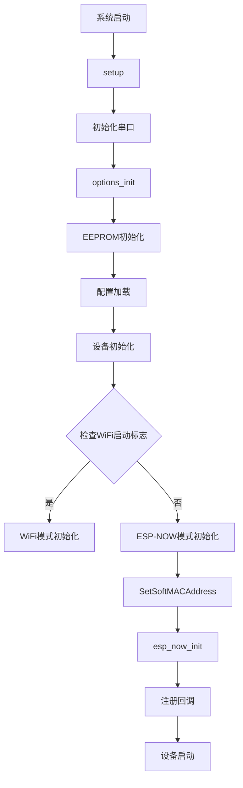
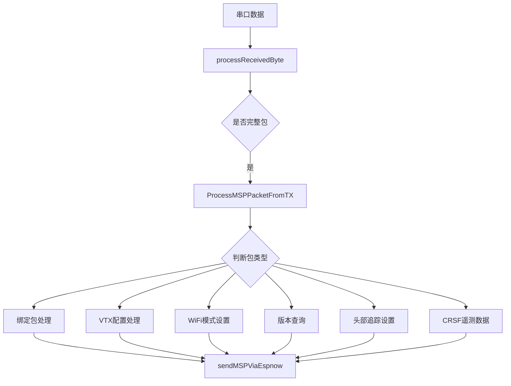
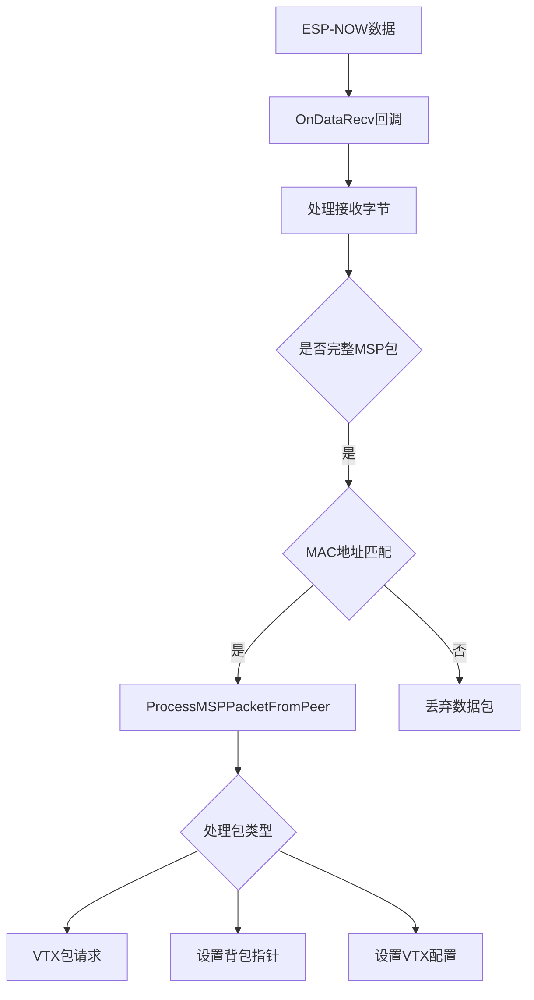
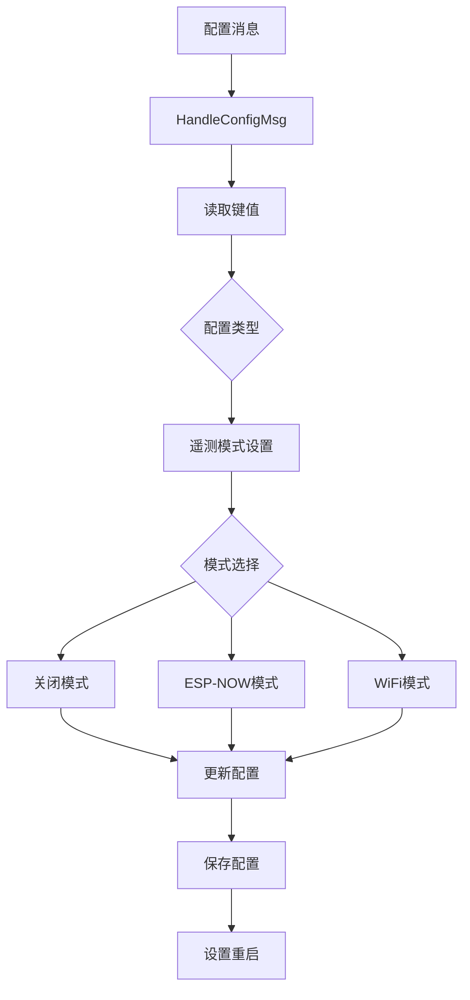

# TX Backpack 项目文档

## 什么是 "TX Backpack"？
TX Backpack 是一个基于 ESP8285 芯片的遥控器背包模块。它集成在部分 ExpressLRS TX 模块中，通过 ESP-NOW 协议实现与其他支持 ESP8285 设备的无线通信。TX-Backpack 的主要目的是实现 ExpressLRS 与其他 FPV 相关设备之间的命令控制和配置查询。

## 功能特点
- 无线配置管理
- 实时状态监控
- 多设备通信支持
- 固件在线更新
- 双模式运行（WiFi/ESP-NOW）

## 支持的设备
主要用于图传接收机（VRX）模块。由于目前市面上很少有内置 ESP8285 的 VRX 模块，通常需要额外添加一个基于 ESP 的接收器（称为"VRX-Backpack"）。这样可以通过 ExpressLRS 控制你的 FPV 眼镜的频段和通道设置。

支持的具体模块列表请参考官方 wiki：
https://github.com/ExpressLRS/Backpack/wiki

## 系统架构

### 硬件要求
- ESP8266/ESP32/ESP8285 微控制器
- EEPROM 存储器
- LED 指示灯
- 按钮接口
- WiFi/ESP-NOW 无线模块

### 软件模块
- 串口通信模块
- 配置管理模块
- 设备控制模块
- 无线通信模块
- 状态管理模块

## 调用流程

### 1. 系统初始化调用流程


### 2. MSP数据包处理流程


### 3. ESP-NOW通信流程


### 4. 配置处理流程


### 5. 主要函数调用关系

#### 初始化相关
- `setup()` 
  - ↳ `options_init()`
  - ↳ `eeprom.Begin()`
  - ↳ `config.Load()`
  - ↳ `devicesInit()`
  - ↳ `SetSoftMACAddress()`
  - ↳ `esp_now_init()`
  - ↳ `devicesStart()`

#### 数据处理相关
- `loop()`
  - ↳ `devicesUpdate()`
  - ↳ `processReceivedByte()`
    - ↳ `ProcessMSPPacketFromTX()`
      - ↳ `sendMSPViaEspnow()`
  - ↳ `SendCachedMSP()`

#### 回调处理
- `OnDataRecv()`
  - ↳ `processReceivedByte()`
    - ↳ `ProcessMSPPacketFromPeer()`
      - ↳ `sendMSPViaEspnow()`

### 6. 关键函数说明

#### 数据发送函数
```cpp
void sendMSPViaEspnow(mspPacket_t *packet)
{
    // 1. 获取数据包大小
    // 2. 转换为字节数组
    // 3. 选择目标地址
    // 4. 发送数据
    // 5. LED指示
}
```

#### 数据接收处理
```cpp
void ProcessMSPPacketFromTX(mspPacket_t *packet)
{
    // 1. 检查是否为绑定包
    // 2. 根据功能类型处理
    // 3. 转发或响应
    // 4. 更新状态
}
```

#### 配置处理
```cpp
void HandleConfigMsg(mspPacket_t *packet)
{
    // 1. 读取配置键值
    // 2. 根据配置类型处理
    // 3. 更新系统配置
    // 4. 保存更改
}
```

## 运行流程

### 1. 主循环处理
```cpp
void loop()
{
    // 1. 设备状态更新
    devicesUpdate(now);

    // 2. 重启检查
    if (rebootTime != 0 && now > rebootTime) {
        ESP.restart();
    }

    // 3. 串口数据处理
    if (Serial.available()) {
        // 处理MSP数据包
        // 处理MAVLink数据包
    }

    // 4. 缓存数据处理
    if (cacheFull && sendCached) {
        SendCachedMSP();
    }
}
```

### 2. 数据处理流程

#### MSP数据包处理
- 接收数据包
  - 串口数据读取
  - 数据包解析
  - 完整性验证
- 处理数据包
  - 命令识别
  - 参数提取
  - 执行对应操作
- 响应处理
  - 生成响应数据
  - 发送响应
  - 更新状态

#### ESP-NOW通信
- 数据接收
  - 回调函数触发
  - MAC地址验证
  - 数据包解析
- 数据发送
  - 数据包构建
  - 选择目标地址
  - 发送确认

### 3. 状态管理
- 连接状态监控
  - WiFi连接状态
  - ESP-NOW连接状态
  - 设备在线状态
- 错误处理
  - 通信错误处理
  - 配置错误处理
  - 硬件错误处理
- 系统恢复
  - 自动重启机制
  - 配置恢复
  - 错误日志记录

### 4. 调试和监控
- 调试信息输出
  - 串口调试信息
  - 状态指示灯控制
  - 错误代码显示
- 性能监控
  - 内存使用监控
  - CPU负载监控
  - 通信质量监控
- 日志记录
  - 运行日志
  - 错误日志
  - 状态变更记录

## 使用说明

### 获取 VRX-Backpack
有多种方式可以获得 VRX-Backpack：
1. DIY 自制
2. 购买现成的兼容产品

详细信息请参考 wiki：
https://github.com/ExpressLRS/Backpack/wiki

### 调试功能
- 串口调试输出
- LED 状态指示
- 错误代码反馈

## 开发指南

### 编译环境
- Arduino IDE 支持
- PlatformIO 支持
- ESP8266/ESP32 SDK

### 代码结构
- `/src` - 源代码目录
- `/include` - 头文件目录
- `/lib` - 依赖库
- `/docs` - 文档

## 注意事项

### 硬件注意事项
- 确保供电稳定
- 检查接线正确
- 注意天线安装

### 软件注意事项
- 正确选择编译选项
- 配置适当的调试级别
- 定期检查系统日志

## 故障排除

### 常见问题
1. 初始化失败
   - 检查供电
   - 验证配置
   - 查看日志

2. 通信异常
   - 检查天线
   - 验证配置
   - 确认固件版本

### 错误代码
- E001: 初始化失败
- E002: 配置错误
- E003: 通信超时

## 贡献指南
欢迎提交 Pull Request 或提出 Issue。请确保：
1. 代码符合项目规范
2. 添加必要的测试
3. 更新相关文档

## 许可证
本项目采用 MIT 许可证

## 联系方式
- 项目 Wiki: https://github.com/ExpressLRS/Backpack/wiki
- 问题反馈: GitHub Issues
- 社区讨论: GitHub Discussions

## 版本历史
- v1.0.0: 初始发布
- v1.1.0: 添加 WiFi 更新功能
- v1.2.0: 优化启动流程